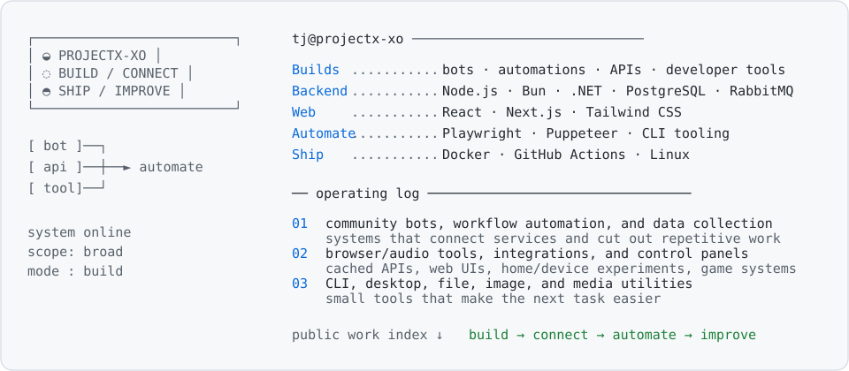

  <picture>
    <source media="(prefers-color-scheme: dark)" srcset="./assets/profile-dark.svg">
    
  </picture>

Public project index

- [STRATCOM / OpenComputer Scripts](https://github.com/projectx-xo/OpenComputer-Scripts) — simulated in-game radar, satellite intelligence, holographic displays, and distributed field nodes for Minecraft OpenComputers.
- [Palantir Client](https://github.com/projectx-xo/palantir-client) — a configurable Fabric HUD for tracking shard membership, players, and factions in Minecraft.
- [tjHBM / HBM’s Nuclear Tech](https://github.com/projectx-xo/HBM-s-Nuclear-Tech) — a customized fork extending OpenComputers integration and simulated in-game radar/satellite systems.

